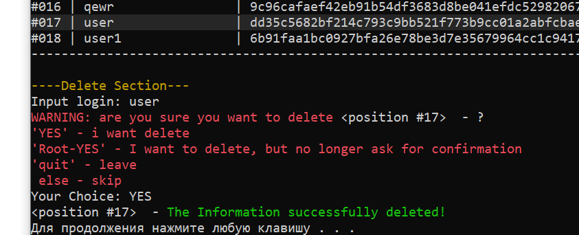

# AirlineTicketSales
Console app with admin and users accounts. You can buy, track and seerach for airpline tickets. (Information stored in files in computer)

---

<b>DESCRIPTION OF THE PROGRAM OPERATION

1. Authorization</b>

At the beginning of authorization, the program offers the user to log in, register a new account or log out (Fig. 1).

    
     
    Figure 1 - Initial menu

If registered, a new account will be created without access to the system. Access will be granted as soon as the administrator approves the application for a new account. If the user already has an account with access to the system, he can log in using his username and password. The hash of the password is checked against what is stored in the file and if they are the same, authorization is completed successfully.

<b>2. Admin Module</b>

The admin module includes viewing, deleting, modifying, sorting, adding account and flight information, and buying tickets, which is an individual task. (Fig. 2 - 4).

    
     
    Figure 2 - Admin Main Menu
     
    
     
    Figure 3 - Flights Section
     
    
     
    Figure 4 - Accounts Section
     

The "Change Account Information" function of the administrator has the ability to edit the Login, Password, Access Level (or role) (fig. 5).

    
     
    Figure 5 - Edit Section
     

Delete account function (fig. 6).

    
     
    Figure 6 - shows the process of deleting an account by login
     

Function for adding an account to the database (figure 7)

    
     
    Figure 7 - adding a new account from on behalf of the administrator
     

Function of Changing Flight parameters such as destination, number, airplane, date, tickets (fig. 8)

    
     
    Figure 8 - process of changing the flight record
     

Function of view all flights(fig. 9) 

    
     
    Figure 9 - view all flights
     

<b>Wow, someone took a long time to scroll / Hi there! :D </b>